# Participation: My First Webpage

## Goal

Apply some of the basic knowledge that we spoke of in class and make our first webpage.

## Instructions

### Part 1: Creating Content

Here we go. Time to make our first webpage! 

Now that we did our readings and have talked about some of the basics, it is time to practice and write our first webpage. We will keep it very simple. We just want to get something going and get our hands dirty, so to speak. 

Here is an example of what we will have by the end of this practice exercise.


First thing that we will need to do is open up our code editor of choice. For this course, I'll probably mostly be using either [VS Code](https://code.visualstudio.com/) or [notepadd++](https://notepad-plus-plus.org/). If you are following along with me for this exercise, then open up VS Code now.

When you open up VS code you should see this screen: 

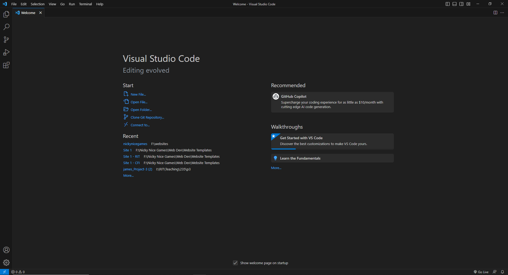

The next thing we will do is make a new file, then right away save it before we do any work at all. I'm going to save mine as `my_first_webpage.html` 

For demo purposes, I'll just save it on my desktop, but you might want to keep things more organised on your home computer.


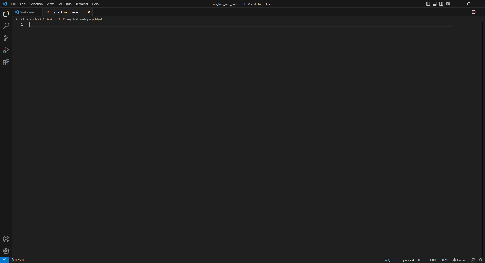

You might have noticed the file extension. (saved as html). Similar to your other programming courses, your file extension tells you the type of file. A lot of the work we will do will be html files. So we give it the `.html` extension. 

HTML stands for hyper text markup language. Ultimately what we will be doing here in this file is "marking up" the page. When we mark up and lable the page correctly, our web broswer can identify certain elements and display them correctly. 

Before we get started creating the content for our webpage. We need to add the most basic elements of the webpage. This is mostly some meta data that tells the browser about our webpage.

And after setting this up, we will put most of our code inside the `body` element. 

Here are the most basic elements. You should always have this on every html file you make.

```
<!DOCTYPE html>
<html lang="en">
<head>
    <meta charset="UTF-8">
    <meta name="viewport" content="width=device-width, initial-scale=1.0">
    <title>Document</title>
</head>
<body>
    
</body>
</html>
```

You can either copy paste the code above into your code editor, or if you have a fancy code editor like VS Code, then you can use a nice utility called Emmet. To learn more about Emmet, you can read up on it's [wikipedia page](https://en.wikipedia.org/wiki/Emmet_(software)).

As a quick start, you can use Emmet. 

To use Emmet to populate the basic elements in VS Code, you can type `!` then tap `tab`.

Wow, look at that, so much progress in such little time. Some were so worried about whether or not we could, no one took the time to ask, whether or not we should.

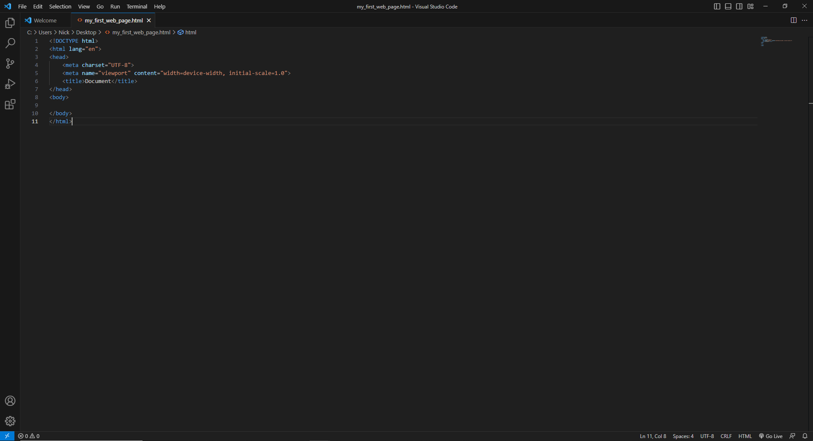

At this point, let's save. Let's look at our web page in a web browser. I'm going to pull up the page in chrome.

You can do this by right clicking on the file and saying "open in chrome" or simply drag the file into your chrome browser.

Now, since we don't have any content yet, I don't expect it to display anything. And that is indeed what we see.

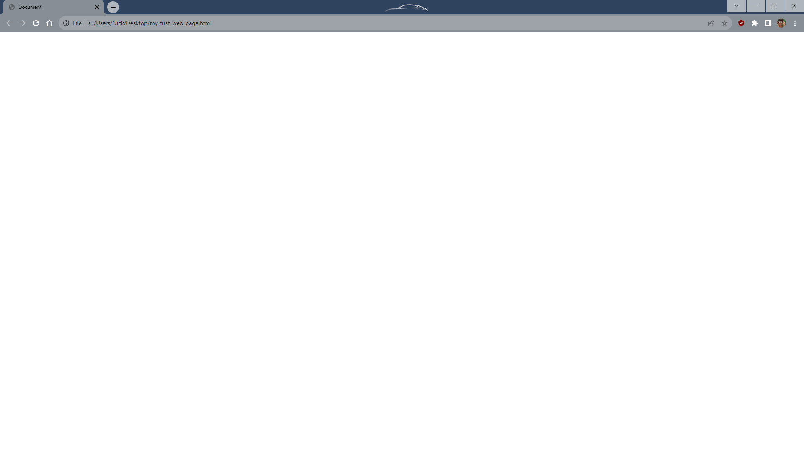

Ok, so now would be a good time to add some content to our webpage.

Inside the `body` tag, we are going to add two more tags, a header 1 and a paragraph.

It should now look like this:

```
<!DOCTYPE html>
<html lang="en">
<head>
    <meta charset="UTF-8">
    <meta name="viewport" content="width=device-width, initial-scale=1.0">
    <title>Document</title>
</head>
<body>
    <h1>This is a title header!</h1>
    <p>Welcome to my first webpage. This is a paragraph. In fact, it's the best paragraph in the history of forever.</p>
</body>
</html>
```

At this point, let's save again.

Now that we have made some basic changes to the content of the page and saved our work. Now is a good time to look at the updates in our web browser. 

After you have saved your changes, hit refresh in your web browser of choice.

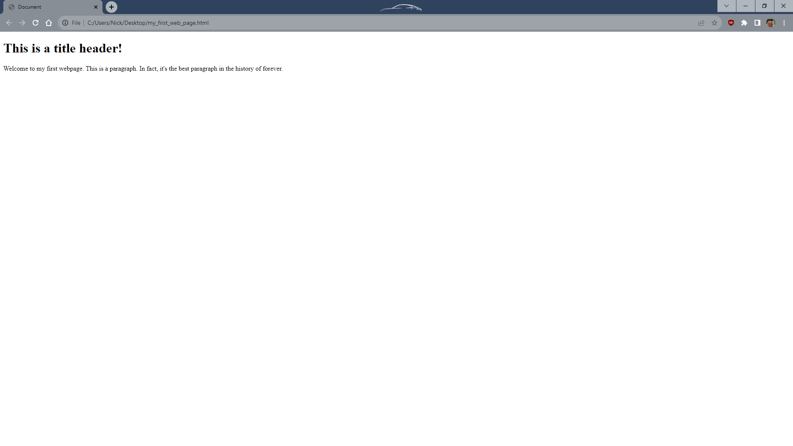

Wow, amazing. Feel the power! 

That's great. You made your first webpage. Congrats!

But oh my goodness, the file is still on your local computer! Gasp! Another big component of web dev is uploading our files to a server. 

So in part two, let's upload this file to a server.

### Part 2: Uploading a file to a server

For this class, we will be hosting files on rit's banjo server, located at `banjo.rit.edu`. Because we are students, RIT has reserved some space on this computer for us to use.

We will need a way to copy paste or transfer the files from our local computer to the banjo server. 

I'll be using [Filezilla](https://filezilla-project.org/) for this. But you can use any FTP software you like. 

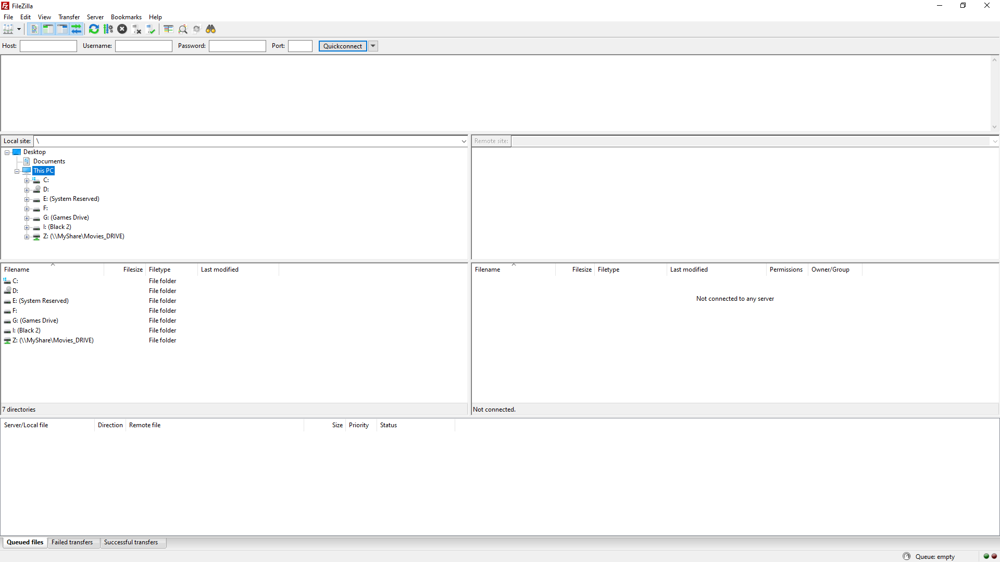

Let's connect to the server.

We will do this by populating some data in the upper left area of filezilla.

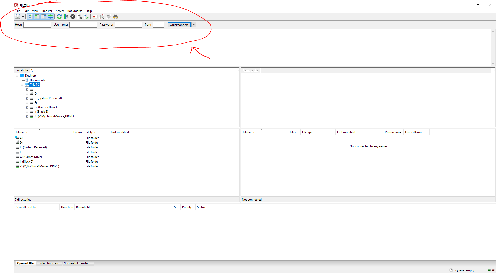

The host is the computer that we want to connect to.
The username and password is of the user account on that machine that you want to log in as.
The port, at least for us at RIT, will be 22.

So, for us, we want to connect to `banjo.rit.edu`, so let's put that in as the hostname.

For the log in info use your RIT account info. 

For example, my username is `nabigm` so I'll put that in. I won't tell you my password. :P 

And then in port, I'll put 22.


When you are ready to connect, click `Quickconnect`.

Now, hopefully, your application updated and you successfully connected to the server. You should see something like this:

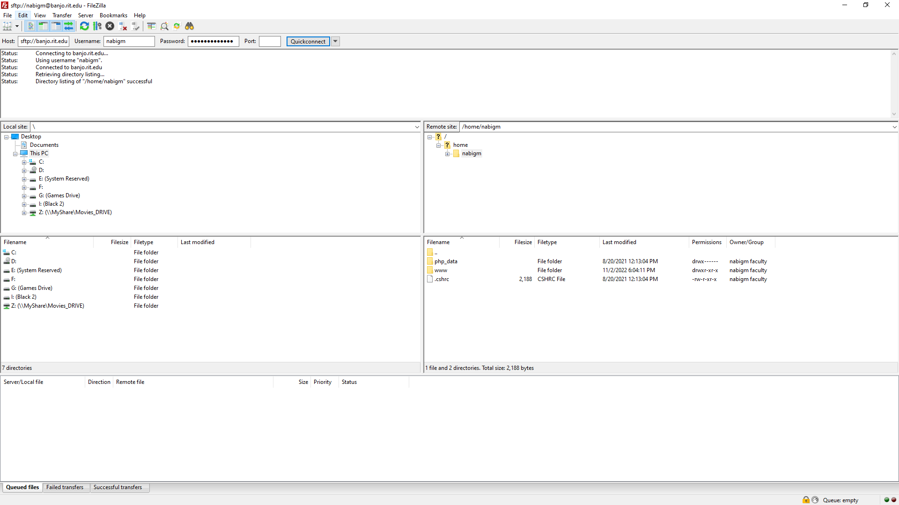

Ok, so one step closer to transfering our file over from our local machine to the server machine.

You might have already noticed, but the stuff on the left side of filezilla is our local machine and the stuff on the right side is the server we just connected to.

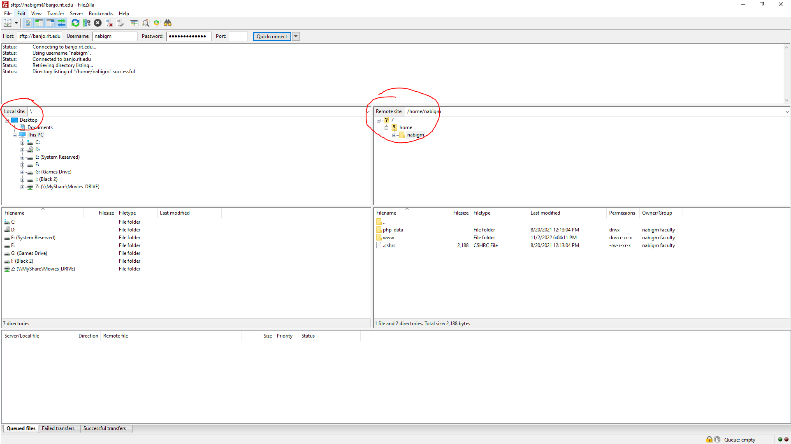

Let's find our file on our local machine. I saved mine to my desktop, so that's a pretty easy find for me, but you need to navigate to wherever you saved yours.

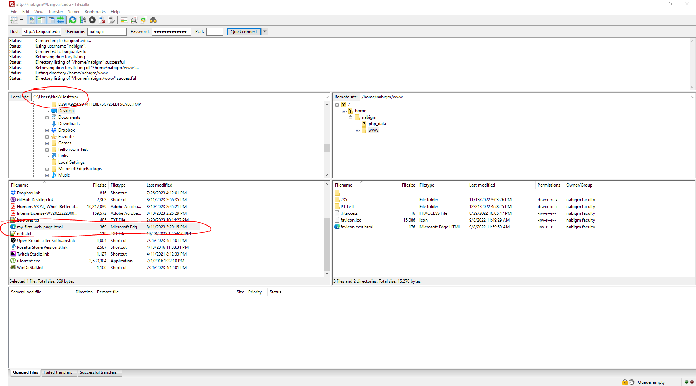

Now on the right, navigate to your `www` folder. It might have put you there by default, but just double check. Your folder is probably empty at this time, but mine had some older stuff in it. So it may look different. 

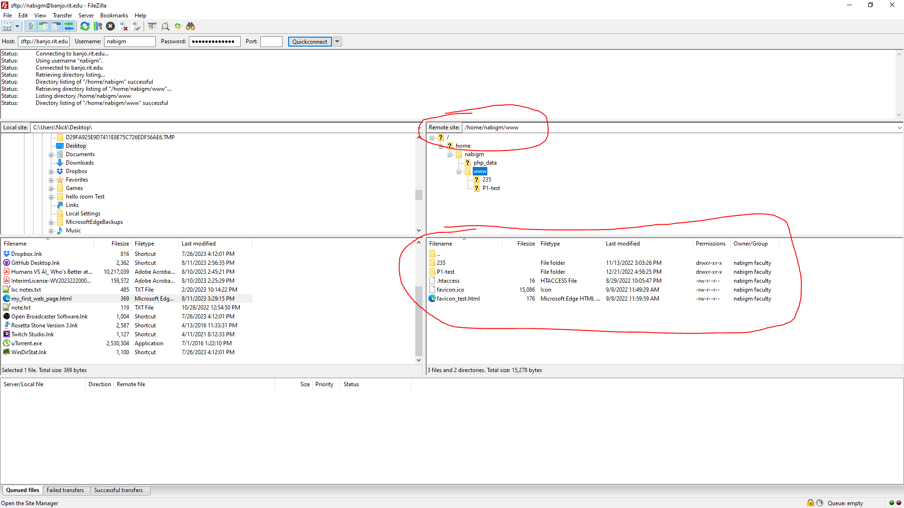

Now comes the surprisingly easy part. Transfering the file.

Just drag over the file from the lower left box to the lower right box.

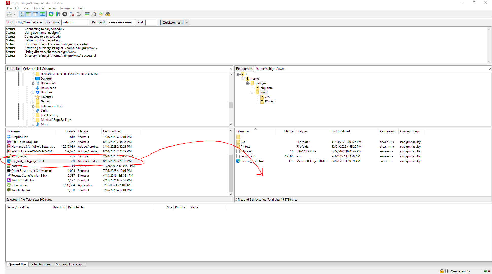

Wow, look at that, it copied it over.


Now that the file is on the server and in the right folder, we should be able to view it from the magical world of the internet and from any computer or mobile device.

We can test that right now.

Let's go head over to `people.rit.edu`.

people.rit.edu hosts the personal web sites of the students, faculty, and staff at RIT.

As a student, faculty, or staff member you receive 1Gb of space to your host personal site, portfolio, resume, class projects, and whatever else you can dream up.

Open up your web browser and type in: `https://people.rit.edu/nabigm/` That's my page. but if you swap out `nabigm` for your rit such as `abc1234` you should see your personal space. 

Then, to see your actual webpage, you need to go to the actual file.

So, actually type `https://people.rit.edu/nabigm/my_first_web_page.html`.

Do you see the glory!?


And with that you have successfully uploaded your first webpage to a server!

Congrats!


This hopefully gave you some hands on experience with creating files and transfering them to a remote server.

## Submitting

Don't forget to submit to the my courses dropbox. See the assignment for submission guidelines.
